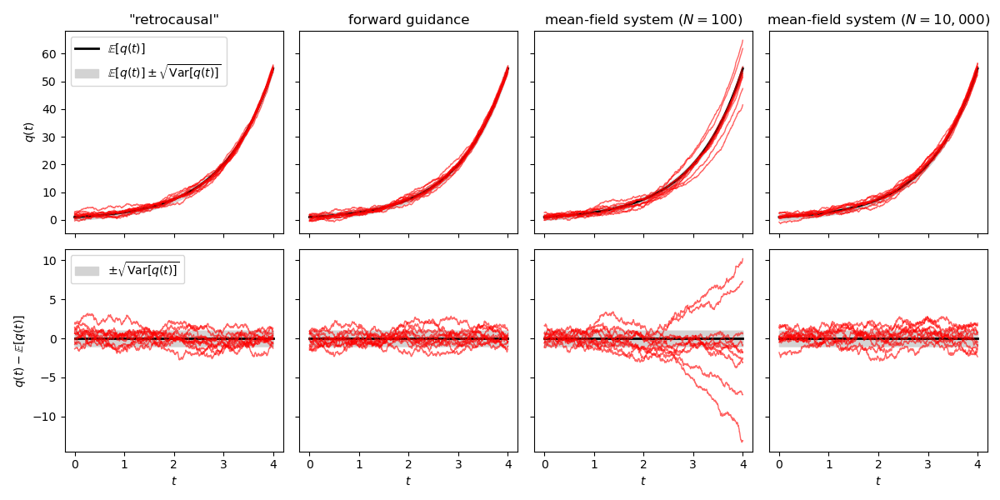

# Q-functionology

Simulations supporting equivalence among forward-time guidance, forward-time mean-field, and "retrocausal" quantum dynamics

https://arxiv.org/abs/2507.13593

## Dependencies

- Python
- Jupyter
- NumPy
- Matplotlib

## Simulations

Run the Jupyter notebook [`simulations.ipynb`](simulations.ipynb) to reproduce figure [`simulations.pdf`](simulations.pdf)

